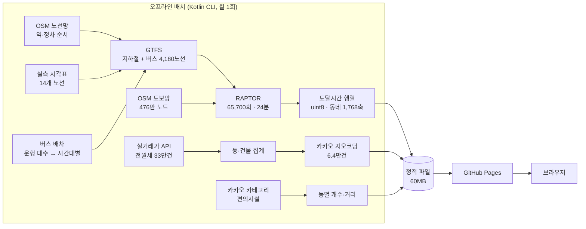

# 출세권 (chulsegwon)

수도권 대중교통 **통근 도달권**으로 자취할 동네를 좁히는 도구.

**▶ https://klaus9267.github.io/chulsegwon/**

> 역세권·숲세권처럼 익숙한 `O세권` 문법을 썼다. "출퇴근이 되는 동네"라는 뜻이고,
> "출세"와 겹쳐 읽히는 것도 노렸다.

직장 역을 고르면 **통근 40분 안에 닿는 동네**를 지도에 칠하고, 그 안에서 원룸·투룸 시세와
편의시설 조건에 맞는 동네를 추려준다. 매물은 갖지 않는다 — 동네를 정해주는 데까지가 우리 몫이고,
실제 방은 직방·네이버로 넘긴다.

---

## 무엇이 다른가

네이버부동산·직방·호갱노노는 **단지별 통근시간 조회**는 되지만, **지도 전체를 도달권으로
필터링**하지는 못한다. 그들의 지표는 매물 조회수인데 지역을 좁혀주면 조회수가 줄기 때문이다.
구조적으로 비어 있는 자리다.

| | 직방·다방 | 호갱노노 | 네이버부동산 | **출세권** |
|---|---|---|---|---|
| 지도 필터 | 영역 그리기 | 단지 조회 | 영역 | ⭐ **통근 도달권** |
| 통근시간 | 단지별 조회 | 단지별 조회 | 단지별 조회 | ⭐ **지도 전체 필터** |
| 맞벌이 2인 | ❌ | ❌ | ❌ | ⭐ **교집합** |
| 편의시설 | 아이콘 표시 | 일부 | 표시 | ⭐ **조건 필터** |
| 실매물 | ⭐ 있음 | 연동 | ⭐ 있음 | ❌ 안 가짐 |

---

## 규모

| | |
|---|---|
| 도달권 계산 | 출발지 657역 × 슬롯 20 × 표본 5 = **65,700회 탐색 24분** (버스·도보 포함) |
| 전월세 실거래 | **329,847건** → 법정동 1,768개 방 종류별 시세 |
| 개별 건물 | 빌라·오피스텔 **62,243동** (지오코딩 성공률 99.99%) |
| 편의시설 | 동별 반경 800m 5종 + 백화점 75곳까지 거리 |
| 대중교통 | 전철 24개 노선(**14개는 실측 시각표**) + 버스 4,180개 노선 · 정류장 68,248 |
| 도보망 | OSM 476만 노드 — 접근·이탈·환승을 실제 길로 잰다 |
| 산출물 | 행렬 44MB(출발지당 69KB) + 시세·편의시설, 클라이언트는 고른 역 것만 받음 |
| 코드 | Kotlin 2,275줄 / TypeScript 3,106줄 |
| 서버 코드 | **0줄** |

정확도는 카카오맵과 **문앞-문앞 OD 46개**로 대조한다 — 60분 예산에서 정밀도 **1.00** ·
재현율 **0.46**, 최선의 출발 분 기준 편향 **+1.0분**. 중앙값이 +8.6분 느린 이유는
[ADR-40](docs/HANDOFF.md#adr-40-없다던-코레일-시각표가-있었다--찾는-데를-안-찾았을-뿐-2026-09-09) 에 적었다 —
카카오는 "지금 나가면"이고 우리는 "슬롯 안 아무 때나 나가면"이라 재는 게 다르다.
([검증 방법](#검증))

---

## 구조

런타임에 경로탐색 엔진을 돌리지 않는다. **입력 공간이 작기 때문이다** — 출발지는 전철역
621개, 시간대는 운행시간 10분 단위 115개 × 방향 2개뿐이다. 전부 미리 계산해 정적 파일로
뿌리면 서버가 필요 없다.



**threshold(40분/50분)를 계산에서 뺀 것**이 이 구조의 핵심이다. 저장하는 건 폴리곤이 아니라
"각 역까지 몇 분" 벡터라, 사용자가 슬라이더를 움직여도 **네트워크 호출이 0**이다.
등시선은 브라우저에서 그 벡터로 매번 다시 그린다(128~413ms, 예산에 비례).

```
브라우저
  도달시간 벡터 ─┬─> 스칼라 필드(격자) ─┬─> marching squares ──> 등시선 폴리곤
                 │                        └─> O(1) 조회 ────────> 동네·건물 필터
                 └─> 역 마커
```

동네·건물을 도달권 안인지 판정할 때 **point-in-polygon을 쓰지 않는다.** 등시선을 뽑기 전의
스칼라 필드를 그대로 찍어보면 산술 두 번이라 O(1)이다. 격자 렌더를 택한 결정이 여기서 한 번 더 값을 한다.

---

## 기술 선택

각 선택의 문제·후보·근거·실측은 **[docs/STACK.md](docs/STACK.md)** 에 정리했다.
**쓰지 않기로 한 것**(RAPTOR·R5/OTP2·Kubernetes·Kafka·MSA)도 같은 형식으로 적어 두었다.

| 층 | 선택 | 한 줄 근거 |
|---|---|---|
| 탐색 | 시간 의존 Dijkstra | 노드 741개는 캐시에 들어간다. RAPTOR가 최적화할 대상이 없다 |
| 시간표 | 배차간격 → 합성 | 실제 시간표를 상시 갱신으로 구할 수 없다. 탐색은 진짜 시간표만 안다 |
| 저장 | uint8 행렬 + 클라이언트 필터 | threshold를 빼면 슬라이더가 네트워크를 안 탄다 |
| 렌더 | 격자 → marching squares | 원 union은 겹칠수록 진해져 "몇 개가 겹쳤나"를 칠하게 된다 |
| 배포 | 정적 파일 + GitHub Pages | 서버가 할 일이 없다. 있으면 장애 지점만 는다 |
| 지도 | 어댑터로 MapLibre ↔ 카카오 | 배경지도를 바꾼다고 계산·UI를 다시 쓸 이유가 없다 |

---

## 실행

```bash
# 도달권 행렬 (약 3초)
./gradlew :builder:run --args="--gml data/raw/metro_graph.gml --out web/public/data --step-min 10"
```

```bash
# 웹
cd web && npm install && npm run dev
```

실거래가·편의시설 수집은 API 키가 필요하다. 루트 `.env` 에 `DATA_GO_KR_KEY`,
`KAKAO_REST_KEY` 를, `web/.env` 에 `VITE_KAKAO_KEY` 를 둔다.

```bash
./builder --mode deals   --rental true --months 6   # 전월세 실거래 수집
./builder --mode reagg                              # 원자료로 재집계 (수집 없이 30초)
./builder --mode donggeo                            # 동 좌표
./builder --mode geocode                            # 건물 좌표 (캐시)
./builder --mode places  --keyword 백화점            # 격자 스캔으로 시설 목록
./builder --mode amenity                            # 동별 편의시설 집계
```

진단·검증:

```bash
./gradlew :builder:run --args="--mode diag --explain 강남>홍대입구 --at 08:00"
./gradlew :builder:run --args="--mode compare --reference tools/reference-kakao.json"
./gradlew :builder:run --args="--mode render --from 강남 --at 08:40 --budget 40 --out data/out/reach.svg"
```

`--mode render` 는 웹앱 없이 도달권을 SVG로 뽑는다. "계산이 틀린 건지 화면이 틀린 건지"를
가를 때 쓴다.

---

## 검증

카카오맵 지하철 경로와 대조했다. 전수(621×621)는 어느 서비스든 약관 위반이라 표본으로
오차 분포만 본다. **강남 출발 · 평일 20:30 · 18쌍:**

| 지표 | 값 |
|---|---|
| 평균 오차(편향) | **−0.9분** |
| 절대 평균 오차 | 3.8분 |
| ±3분 이내 | 67% |
| ±7분 이내 | 89% |

비교는 **문앞-문앞**으로 한다. 카카오의 대표 숫자는 승차~하차만 세고 우리 값은 대기를
포함하므로, 기준값을 `(승차시각 − 기준시각) + 승차시간` 으로 환산해야 같은 정의가 된다.
이걸 안 맞추면 우리가 항상 나쁘게 나온다.

남은 이상치:

| 구간 | 차이 | 원인 |
|---|---|---|
| 강남→노원 | +9분 | 2호선 장거리 우회. 7호선 직결 대안을 못 찾음 |
| 강남→안산 | −12분 | 4호선 안산선 장구간 표정속도(50km/h) 과대 추정 |

---

## 지금의 한계

정직하게 적는다. 대부분은 데이터의 한계고, 해결할 순서는 [docs/TASKS.md](docs/TASKS.md) 에 있다.

| 항목 | 지금 | 남은 것 |
|---|---|---|
| 역·노선 | ✅ **OSM** — GTX-A·신림선·대곡소사선·별내선·진접선 포함 | 자원봉사 자료라 한쪽 방향에만 정차가 적힌 역이 몇 개 있다 |
| 전철 시각표 | ✅ **14개 노선 실측** (서울교통공사 + 코레일). 편수가 원자료와 일치 | 신분당·공항철도·경전철 10개는 배차 추정 — 공개 시각표가 없다 |
| 급행 | ✅ **46개 패턴** (1·4·9호선·수인분당) | **경의중앙 급행**은 어느 자료에도 없다 |
| 버스 | ✅ 4,180개 노선 (TAGO + GBIS 마을버스) | 구간 소요시간은 실시간 속도 스냅샷에서 적합한 추정이다 |
| 버스 배차 | 시간대별 — 운행 대수에서 역산 | 실제 배차표는 공개돼 있지 않다 |
| 도보 | ✅ OSM 도보망 476만 노드 | — |
| 검증 | 카카오 OD 46개 · 불변식 5종 | **분포끼리** 대보지 못했다 — 카카오를 여러 시각에 물어야 한다 |
| 시세 | 실거래가 중위값 — **호가·실매물이 아님** | 구조적 한계. 흐리지 않는다 |

---

## 문서

| | |
|---|---|
| [docs/HANDOFF.md](docs/HANDOFF.md) | 설계 결정 40개(ADR)와 근거, 개발하며 만난 난관과 교훈 |
| [docs/TASKS.md](docs/TASKS.md) | **열린 과제** — 우선순위와 완료 조건 |
| [docs/HISTORY.md](docs/HISTORY.md) | 무엇을 언제 했는지 — 흐름과 숫자 |
| [docs/STACK.md](docs/STACK.md) | 기술 선택의 이유 — 쓴 것과 **쓰지 않은 것** |
| [docs/PRODUCT.md](docs/PRODUCT.md) | 제품 기획 — 타겟, 경쟁 서비스와의 자리, 로드맵 |

## 출처·라이선스

- 역 그래프: [stripe2933/SeoulMetropolitanSubway](https://github.com/stripe2933/SeoulMetropolitanSubway) (MIT)
- 실거래가: 국토교통부 실거래가 공개시스템 (data.go.kr)
- 장소·지오코딩: 카카오 로컬 API
- 배경지도: 카카오맵 / CARTO Positron / OpenStreetMap contributors
